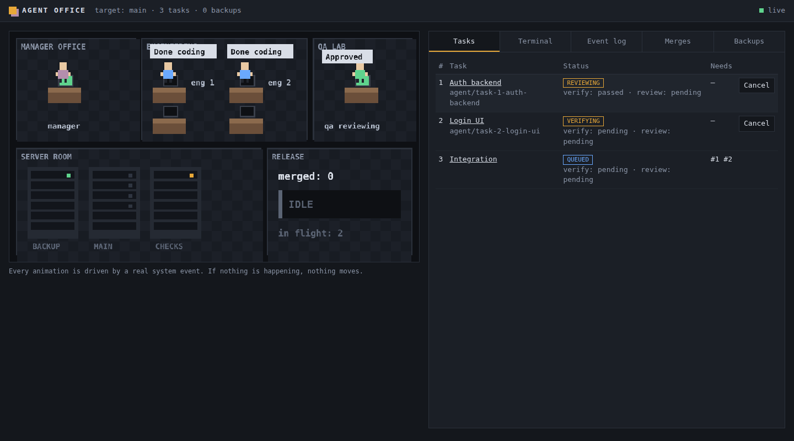

<h1 align="center">Agent Office</h1>

<p align="center">
  <b>Watch real coding agents work in isolated Git worktrees. Trust every merge.</b><br>
  A local-first workspace where autonomous agents propose, and deterministic code enforces safety.
</p>

<p align="center">
  
  
  
  
</p>

---

## What it does

Give Agent Office a task. It creates an isolated Git worktree, starts a real agent process in it, and runs the result through a fixed pipeline before anything touches your main branch:

```
 task ─▶ worktree ─▶ agent ─▶ commit ─▶ verify ─▶ independent review
                                                        │
   result ◀─ post-merge verify ◀─ auto-merge ◀─ pre-merge backup
```

Every step is recorded in SQLite. Every automatic merge has a recoverable pre-merge state, and rollback needs nothing but that recorded state.

<p align="center"></p>

> **Status:** the core loop, the Manager (goal → validated task graph) and the live office UI work and are tested. The Electron packaging and the agent-backed QA reviewer are next. See the [roadmap](#roadmap).

## Guarantees (enforced in code, not by prompting)

| Guarantee | How |
|---|---|
| Agents never work in your main tree | One branch + worktree per task, outside the repo; any write to the main tree fails the task |
| No merge without a backup | `refs/heads/backup/pre-merge-<time>-task-<id>` is created, re-read and compared before merging; backup failure aborts |
| No merge on stale or unverified state | Target head, source commit, backup, clean tree, passed checks and approved review are all re-checked at merge time |
| Agent claims are not evidence | Checks (`test`, `typecheck`, `lint`, `build`) are actually run, before and after the merge |
| Author does not review own work | The reviewer id must differ from the implementing agent |
| Rollback is deterministic | `reset` to the recorded backup sha, only if the target still points at the merge |
| No paid inference API | Agents are CLI processes using your existing login; `*_API_KEY`/`*_TOKEN`/`*_SECRET` are stripped from their environment |

## Quick start

Requirements: Node.js 22.18 or newer, Git.

```bash
npm install
npm test           # 50 tests on disposable temp repos
npm run typecheck
npm run demo       # full loop on a throwaway repo, prints the event trail
npm run ui         # live office UI on a throwaway repo: open http://127.0.0.1:4173
```

Run one task with a real agent CLI (uses that CLI's own login, on a throwaway repo):

```bash
node scripts/real-agent.ts claude      # or: codex | opencode
```

<details>
<summary>Windows notes</summary>

- PowerShell stub run: `$env:AGENT_OFFICE_FAKE=1; node scripts/real-agent.ts` (cmd: `set AGENT_OFFICE_FAKE=1 && node scripts/real-agent.ts`).
- `node-pty` has install scripts. If npm warns about `allow-scripts`, run `npm approve-scripts node-pty` then `npm rebuild node-pty`.
- The suite has not been run on Windows by the author; please report failures with the first failing block.
</details>

## Architecture

```
UI (later)  ─ typed IPC ─▶  Event / State  ─▶  Orchestrator  ─▶  Task engine
                                                                     │
                       Repository / worktrees ◀─ Git control plane ◀─ Agent runtime
```

| Piece | File |
|---|---|
| Typed events (also the audit log) | `src/core/events.ts` |
| Explicit task state machine | `src/core/taskMachine.ts` |
| SQLite state (`node:sqlite`) | `src/core/store.ts` |
| Pipeline, scheduler, recovery | `src/core/orchestrator.ts` |
| Verification and review gates | `src/core/verify.ts`, `src/core/review.ts` |
| Worktrees, backup, merge, rollback, policy | `src/git/*` |
| Agent providers (pipes, PTY, CLI detection) | `src/agents/*` |
| Manager: plan validation, Claude planner | `src/manager/*` |
| Local UI server (HTTP + SSE, token-protected actions) | `src/server/server.ts` |
| Office UI: event reducer, canvas scene, panels | `ui/*` |

Task lifecycle: `QUEUED → ASSIGNED → WORKING → VERIFYING → REVIEWING → READY_TO_MERGE → MERGING → COMPLETED`, plus `BLOCKED`, `FAILED`, `CONFLICT`, `CANCELLED`. Illegal transitions throw.

Full design, stack decisions and the Electron IPC boundary: [docs/architecture.md](docs/architecture.md). MVP scope, test map and phases: [docs/plan.md](docs/plan.md).

## What is tested

50 tests, all on disposable temp repositories: worktree isolation and parallelism, path and symlink validation, task dependencies, process termination and timeouts, backup creation and backup failure, merge with stale target / wrong backup / dirty tree, conflicts, failed pre- and post-merge verification, rollback, isolation breach, PTY sessions, and restart recovery at three crash points.

## Roadmap

- [x] Git control plane, state machine, SQLite, verification, review gate, backup, merge, rollback, recovery
- [x] Provider interface, pipe and PTY providers, Claude Code / Codex / OpenCode detection and argv
- [x] First verified run with a real CLI agent (Claude Code via PTY on Windows: worktree → agent → verify → review → backup → merge → post-verify, `COMPLETED`)
- [x] Manager agent: goal → validated, dependency-aware task graph (deterministic gate)
- [x] Live office UI in the browser: pixel office, tasks, terminal, event log, merges, backups, rollback and cancel
- [ ] Agent-backed QA reviewer, OS-level sandboxing of agent processes
- [ ] Electron packaging of the UI (typed IPC), diff and reviews views
- [ ] Wire Manager into the UI (enter a goal, watch the plan run)

## Known limits

Agents are not OS-sandboxed yet (escapes into the main tree are detected, not prevented). Merges run in your main working tree, which must be clean. The unattended CLI flags (`--permission-mode acceptEdits`, `--full-auto`) are a decision to revisit before real use. A failed post-merge check keeps the merge and offers rollback; it does not roll back on its own.
